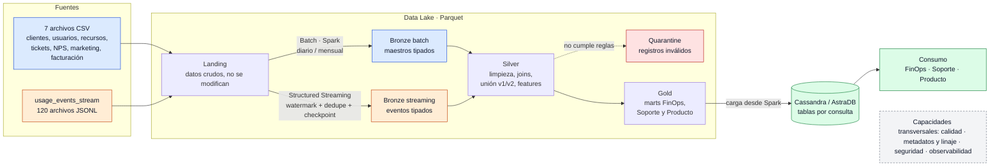

# 3. Arquitectura v1

> Proyecto: Cloud Provider Analytics · Minería de Datos II · ISTEA 2C 2026
> Versión: 1.0 · 04/10/2026 · Patrón elegido: **Lambda** (ver [D-02](../DECISIONS.md))

## 3.1 Diagrama general

**Cómo leerlo:** lo azul es el camino **batch** (los CSV) y lo naranja es el camino **streaming** (los eventos). Los dos se juntan en Silver y Gold. Lo verde es lo que ve el usuario final.

## 3.2 Componentes

| Componente | Qué hace | Herramienta |
|---|---|---|
| Fuentes | Los archivos que nos da la cátedra: 7 CSV y 120 JSONL | Archivos en el repo (`data/`) |
| Landing | Guardo los archivos tal cual llegan. No se tocan nunca | Carpeta del Data Lake |
| Ingesta batch | Leo los CSV con un esquema definido y los paso a Parquet | PySpark (`spark.read`) |
| Ingesta streaming | Leo los eventos a medida que aparecen, descarto duplicados y tolero los que llegan tarde | Spark Structured Streaming |
| Bronze | Mismos datos que la fuente, pero con tipos correctos y dos columnas extra: cuándo se cargaron (`ingest_ts`) y de qué archivo vienen (`source_file`) | Parquet particionado |
| Silver | Limpio, convierto tipos, uno eventos con los maestros, unifico v1 y v2 y calculo features | PySpark |
| Quarantine | Lo que no pasa las reglas de calidad se separa acá, para revisarlo y no perderlo | Parquet |
| Gold | Tablas listas para responder las preguntas de negocio (marts) | Parquet |
| Serving | Cargo los marts en tablas pensadas para cada consulta | Cassandra / AstraDB |
| Consumo | FinOps, Soporte y Producto consultan los resultados | CQL / herramientas de visualización |

## 3.3 Cómo encaja con Lambda

| Capa de Lambda | En mi proyecto |
|---|---|
| **Capa batch** | Camino de los CSV: Landing → Bronze batch → Silver |
| **Capa de velocidad** (*speed layer*) | Camino de los eventos: Landing → Bronze streaming → Silver |
| **Capa de servicio** (*serving layer*) | Gold → Cassandra / AstraDB |

## 3.4 Capacidades transversales

Son cosas que atraviesan todo el pipeline, no una sola etapa:

- **Calidad:** reglas de validación en cada paso y quarantine para lo que falla.
- **Metadatos y linaje:** cada fila guarda de qué archivo vino y cuándo se cargó, así puedo rastrearla hasta el origen.
- **Seguridad:** sin contraseñas ni tokens en el repo; las credenciales de AstraDB van por variables de entorno.
- **Observabilidad:** logs de cada ejecución con conteos (cuántos registros entraron, cuántos pasaron, cuántos fueron a quarantine).

El detalle de cada zona del Data Lake (formatos, particiones, nombres y retención) está en el documento 04.
