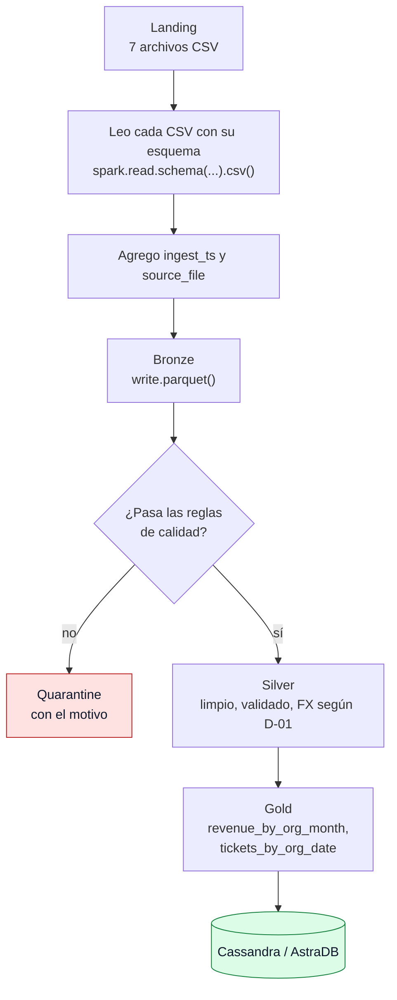
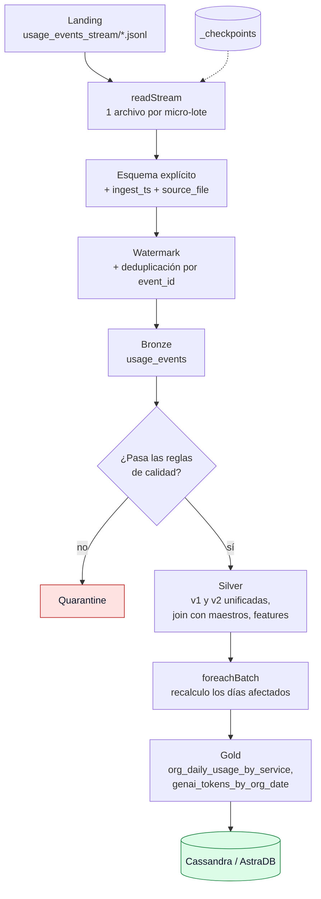

# 5. Flujos de datos: batch y streaming

> Proyecto: Cloud Provider Analytics · Minería de Datos II · ISTEA 2C 2026
> Versión: 1.0 · 04/10/2026 · Ver también: [03 · Arquitectura](03_arquitectura.md) y [04 · Data Lake](04_data_lake.md)

Como elegí Lambda (D-02), tengo dos flujos: uno **batch** para los CSV y otro **streaming** para los eventos. Acá describo cada uno paso a paso, con la herramienta que uso en cada etapa.

## 5.1 Flujo batch (archivos CSV)



| Paso | Qué hago | Herramienta |
|---|---|---|
| 1 | Leo cada CSV de Landing con un esquema que defino yo (no uso `inferSchema`) | `spark.read.schema(...).csv()` |
| 2 | Agrego las columnas `ingest_ts` (fecha y hora de carga) y `source_file` (nombre del archivo) | `withColumn`, `current_timestamp()`, `input_file_name()` |
| 3 | Guardo en Bronze. La facturación la particiono por `month` | `write.mode("overwrite").parquet()` |
| 4 | Aplico las reglas de calidad. Lo que no pasa va a quarantine con el nombre de la regla | `filter` |
| 5 | Limpio y conformo: casteo tipos, valido CSAT y NPS, aplico el tipo de cambio según D-01 | `withColumn`, `when`, `groupBy` (promedio de FX) |
| 6 | Armo los marts de Gold | `groupBy` + `agg` |
| 7 | Cargo los marts en Cassandra | Conector Spark–Cassandra |

**Frecuencia:**
- Maestros (clientes, usuarios, recursos, tickets, NPS): **una vez por día**.
- Facturación: **una vez por mes**, cuando llega el cierre.

## 5.2 Flujo streaming (eventos de uso)



| Paso | Qué hago | Herramienta |
|---|---|---|
| 1 | Leo la carpeta de eventos de a **un archivo por vez**, para simular la llegada en micro-lotes | `readStream` con `maxFilesPerTrigger = 1` |
| 2 | Uso un esquema explícito. `value` lo leo como texto y lo convierto después, porque llega mezclado | `.schema(...)` |
| 3 | Agrego `ingest_ts` y `source_file` | `withColumn` |
| 4 | Defino el watermark y saco los duplicados por `event_id` | `withWatermark`, `dropDuplicates` |
| 5 | Guardo en Bronze, particionado por `event_date` | `writeStream` + checkpoint |
| 6 | Aplico las reglas de calidad y separo lo inválido a quarantine | `filter` |
| 7 | Conformo en Silver: unifico v1 y v2, convierto `value` a número, uno con organizaciones y recursos, calculo las features | `withColumn`, `join` |
| 8 | En cada micro-lote recalculo en Gold **solo los días que llegaron** y los cargo en Cassandra | `foreachBatch` |

Así se vería la parte central de la lectura (es una idea del diseño; el código final va en el Parcial 2):

```python
eventos_stream = (
    spark.readStream
    .schema(esquema_eventos)               #esquema definido por mí
    .option("maxFilesPerTrigger", 1)       #un archivo por micro-lote
    .json(f"{LANDING}/usage_events_stream")
)

eventos_sin_duplicados = (
    eventos_stream
    .withColumn("event_ts", F.to_timestamp("timestamp"))
    .withWatermark("event_ts", WATERMARK)  #valor a definir (ver D-04)
    .dropDuplicates(["event_id"])
)
```

### El problema del watermark

En la exploración vi que **cada archivo trae eventos de los dos meses mezclados** (julio y agosto), no ordenados.

El watermark le dice a Spark: "si un evento llega con más de X tiempo de atraso respecto del más nuevo que ya viste, descartalo". Si pongo un valor típico como 10 minutos, después del primer archivo Spark ya habría visto eventos de fines de agosto y descartaría casi todos los de julio por "tardíos".

**Qué hago:**

- Uso un **watermark amplio**. El valor exacto queda como decisión abierta, para ajustarlo en el Parcial 2 cuando lo pruebe con los datos (D-04).
- No dependo del watermark para que Gold quede bien: en cada micro-lote recalculo los días que aparecieron y reescribo esas particiones. Si llega un evento viejo, su día se vuelve a calcular completo.

### Checkpoint

El checkpoint es una carpeta donde Spark anota qué archivos ya procesó. Si el streaming se corta y lo vuelvo a arrancar, sigue desde donde quedó y no procesa dos veces lo mismo.

## 5.3 Cómo se juntan los dos flujos

Los dos caminos se cruzan en **Silver**: los eventos se unen con los maestros (organizaciones y recursos) que vienen del batch. Por eso el batch de maestros tiene que correr **antes** que el streaming: si no, los eventos no encuentran con quién unirse.

| Mart de Gold | Viene de |
|---|---|
| `org_daily_usage_by_service` | streaming (eventos) + batch (organizaciones) |
| `genai_tokens_by_org_date` | streaming |
| `cost_anomaly_mart` | streaming |
| `revenue_by_org_month` | batch (facturación) |
| `tickets_by_org_date` | batch (tickets) |
