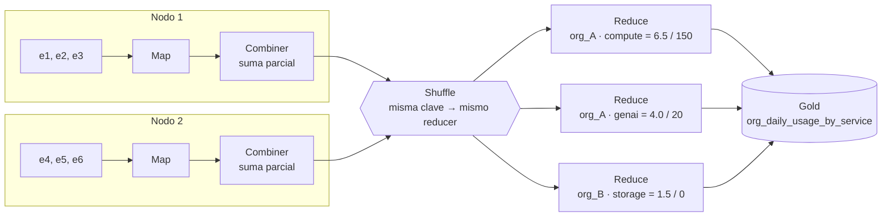

# 6. Procesamiento batch con lógica MapReduce

> Proyecto: Cloud Provider Analytics · Minería de Datos II · ISTEA 2C 2026
> Versión: 1.0 · 04/10/2026 · Ver también: [05 · Flujos](05_flujos.md)

La consigna pide mostrar cómo se resolvería el procesamiento batch con lógica MapReduce. Para eso tomo el mart más importante del proyecto: **`org_daily_usage_by_service`**, que tiene el costo y los requests de cada organización, por día y por servicio. Es el que responde las consultas 1 y 2.

## 6.1 Las tres fases

| Fase | Qué hace | En mi caso |
|---|---|---|
| **Map** | Recorre cada registro y lo convierte en un par **clave → valor** | Cada evento se transforma en `(org_id, fecha, servicio) → (costo, requests)` |
| **Shuffle / Sort** | Junta todos los pares que tienen la **misma clave**, aunque estén en nodos distintos | Todos los eventos de la misma organización, día y servicio terminan juntos |
| **Reduce** | Combina los valores de cada clave | Sumo los costos y sumo los requests |

> `requests` vale el `value` del evento cuando la métrica es `requests`, y 0 en los demás casos (`cpu_hours`, `storage_gb_hours`). Ese cálculo lo hago antes, en Silver.

## 6.2 Ejemplo a mano

Tomo 6 eventos inventados del mismo día (01/08/2025), repartidos en 2 nodos.

**Datos de entrada:**

| Nodo | Evento | Organización | Servicio | Costo (USD) | Requests |
|---|---|---|---|---|---|
| 1 | e1 | org_A | compute | 2,0 | 0 |
| 1 | e2 | org_A | compute | 1,5 | 100 |
| 1 | e3 | org_B | storage | 0,5 | 0 |
| 2 | e4 | org_A | compute | 3,0 | 50 |
| 2 | e5 | org_B | storage | 1,0 | 0 |
| 2 | e6 | org_A | genai | 4,0 | 20 |

**1. Map:** cada evento se convierte en un par clave → valor.

```
Nodo 1                                     Nodo 2
(org_A, 01/08, compute) → (2.0, 0)         (org_A, 01/08, compute) → (3.0, 50)
(org_A, 01/08, compute) → (1.5, 100)       (org_B, 01/08, storage) → (1.0, 0)
(org_B, 01/08, storage) → (0.5, 0)         (org_A, 01/08, genai)   → (4.0, 20)
```

**2. Combiner (agregación parcial):** antes de mandar nada por la red, cada nodo suma lo que tiene de la misma clave. Así viajan menos datos.

```
Nodo 1                                     Nodo 2
(org_A, 01/08, compute) → (3.5, 100)       (org_A, 01/08, compute) → (3.0, 50)
(org_B, 01/08, storage) → (0.5, 0)         (org_B, 01/08, storage) → (1.0, 0)
                                           (org_A, 01/08, genai)   → (4.0, 20)
```

**3. Shuffle / Sort:** los pares viajan para que cada clave quede en un solo lugar.

```
(org_A, 01/08, compute) → [(3.5, 100), (3.0, 50)]
(org_A, 01/08, genai)   → [(4.0, 20)]
(org_B, 01/08, storage) → [(0.5, 0), (1.0, 0)]
```

**4. Reduce:** sumo los valores de cada clave.

| org_id | fecha | servicio | daily_cost_usd | requests |
|---|---|---|---|---|
| org_A | 01/08/2025 | compute | 6,5 | 150 |
| org_A | 01/08/2025 | genai | 4,0 | 20 |
| org_B | 01/08/2025 | storage | 1,5 | 0 |

**Control:** el costo total de entrada es 2 + 1,5 + 0,5 + 3 + 1 + 4 = **12 USD**, y el de salida es 6,5 + 4 + 1,5 = **12 USD**. Los requests también cierran: 100 + 50 + 20 = **170**. No se perdió nada en el camino.

## 6.3 Diagrama



## 6.4 Lo mismo en PySpark

**Versión con RDD** (como en las diapositivas de clase: `map` + `reduceByKey`):

```python
pares = (
    eventos_silver.rdd
    .map(lambda e: ((e.org_id, e.event_date, e.service),   #clave
                    (e.cost_usd, e.requests)))             #valor
)

#sumo costo con costo y requests con requests
resultado = pares.reduceByKey(lambda a, b: (a[0] + b[0], a[1] + b[1]))
```

**Versión con DataFrame** (la que voy a usar en el proyecto):

```python
mart = (
    eventos_silver
    .groupBy("org_id", "event_date", "service")
    .agg(
        F.sum("cost_usd").alias("daily_cost_usd"),
        F.sum("requests").alias("requests"),
    )
)
```

Probé las dos versiones con los 6 eventos del ejemplo y dan exactamente el mismo resultado que la tabla de 6.2.

## 6.5 Dónde se ve MapReduce dentro de Spark

Aunque con DataFrames no escribo "map" ni "reduce", Spark hace lo mismo por dentro. Si ejecuto `mart.explain()`, el plan físico muestra las tres fases (lo leo de abajo hacia arriba):

```
HashAggregate(keys=[org_id, event_date, service], functions=[sum(cost_usd), sum(requests)])                  ← Reduce
+- Exchange hashpartitioning(org_id, event_date, service)                                                    ← Shuffle
   +- HashAggregate(keys=[org_id, event_date, service], functions=[partial_sum(cost_usd), partial_sum(...)]) ← Map + Combiner
      +- Scan
```

- `partial_sum` es el **combiner**: cada partición suma lo suyo.
- `Exchange` es el **shuffle**: es el límite entre dos stages, como vimos en el simulador de clase.
- El `HashAggregate` de arriba es el **reduce**: la suma final por clave.

## 6.6 ¿Por qué uso Spark y no Hadoop MapReduce?

La lógica es la misma, pero Spark:

- guarda los resultados intermedios **en memoria**, mientras que Hadoop MapReduce escribe a disco al terminar cada trabajo;
- arma el plan completo (DAG) antes de ejecutar y lo optimiza (evaluación perezosa);
- me deja escribir lo mismo con DataFrames, que es más corto y más fácil de leer que programar el map y el reduce a mano.
